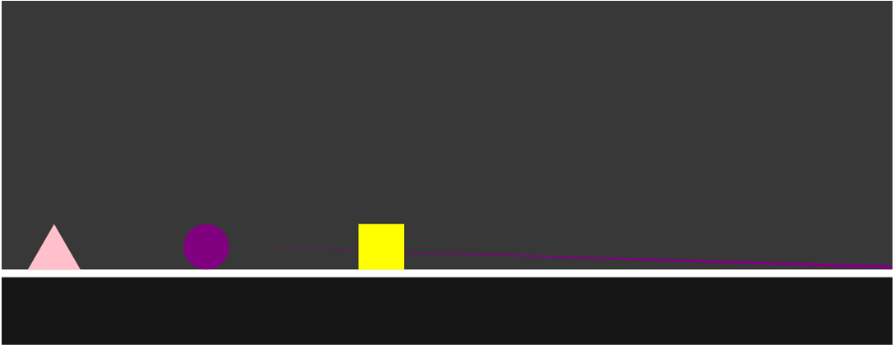
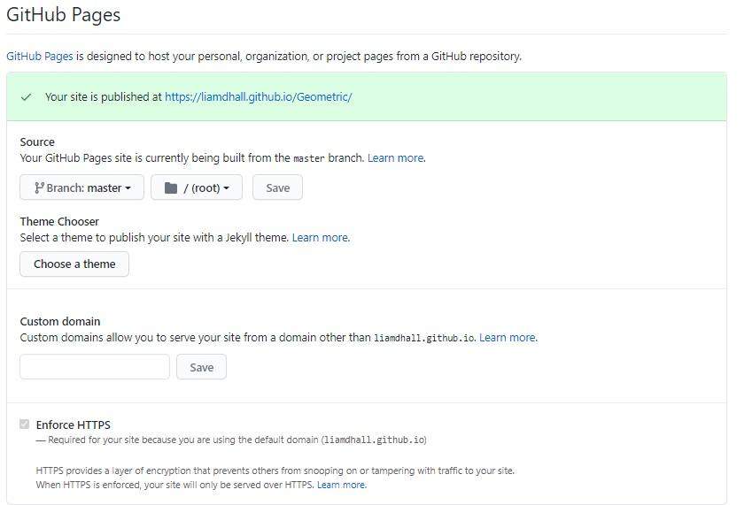
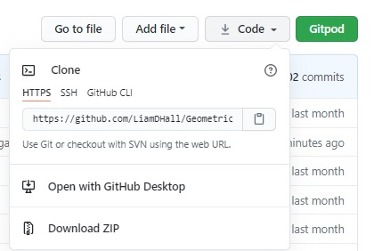

# Geometric
*Liam Hall Milestone Project 2 (Interactive Frontend Development)*

This is my second project studying with [The Code Institute](https://codeinstitute.net/)

The aim of this project is to create a font-end web application focusing on interactive design and the web application's response to user input.

With this in mind I decided to make a game. I've always loved playing web based games while growing up, mainly on 

sites like [Miniclip](https://www.miniclip.com/) and I am pleased to now have the skills to be able to

create one of my own. Geometric is an endless scroller meaning the player themself doesn't move but

the movement of the world and the objects around them give the simulation of movement. The game contains three

types of obstacles "enemies" and a floor object. The three obstacles then have unique mechanics:

Circles explode when hit by the players laser, Triangles reflect the players lasers and Rectangles (Sqaures) 

are used to jump over gaps in the floor. All cause the player to crash if hit. Though the player is not told 

this before playing the game, the first few maps of the game are designed to introduce the player to Geometric mechanics. 

A learn by doing approach. I created a game I enjoy playing and created it with the intent to entertain people. The target

audience for this game is teenagers and adults looking for a fun, challenging and interactive game they can play multiple times.

This game is both easy to learn yet hard to master.

The default controls are as follows:

    W = Jump
    D = Shoot

**Though the game plays in portrait a better experience is achieved by playing in landscape**
**I recommend playing with your volume at 50% and work up as the sound effects are at different volumes**

[Play The Game](https://liamdhall.github.io/Geometric/)

## Contents

-   [**UX**](#UX)
    -   [User Stories](#User-Stories)
-   [**Develoyment**](#Development)
    -   [Planning](#Planning)
    -   [Ideas](#Ideas)
    -   [Approach](#Approach)
    -   [Level Mapping](#Level-Mapping)
    -   [Hero Triangle Treated as a Circle](#Hero-Triangle-Treated-as-a-Circle)
    -   [#JavaScript in Head](#JavaScript-in-Head)
    -   [Console Logs](#Console-Logs)
    -   [Media](#Media)
    -   [Commit Messages](#Commit-Messages)
- [**Features**](#Features)
    -   [Live Features](#Live-Features)
    -   [Features Left to Implement](#Features-Left-to-Implement)
- [**Technologies Used**](#Technologies-Used)
- [**Testing**](#Testing)
    -   [Functionality](#Functionality-Testing)
    -   [Bug Report](#Bug-Report)
- [**Deployment**](#Deployment)
    -   [Remote Deployment](#GitHub-Pages-Remote-Development)
    -   [Local Deployment](#Cloning-Local-Development)
- [**Credits**](#Credits)

 
## UX

With the main focuses being interactiveness, I created a simple menu system which is easy to navigate through so that the player can
get the information or complete the task they wish to complete. This is quickly done so they can jump back into the game as soon as
possible. 

In the menu system a player will recieve feeback on their actions such as setting a new key for jumping. They are also 
informed when a new key is set. Choosing a new laser colour is clearly highlighted when one is selected.

During the game the user will be in control of the hero character using the default keys or the keys they have set themselves.
Once the game is over the user is then presented with their final score with the option to play again or return to the 
main menu.

The game is responsive to screen size so it can be played on multiple devices. The user has the ablity to pause the game and step
away if required. If users don't come to the end of their game or want to go back to main menu they can do this from the pause
menu.

Users can mute the game when ever they want by using the mute button located in the top right had corner of the page. 

### User Stories

Before creating the game I asked a few people what they would what from a game:

**As a potential player**

- I want to be able to customise my character as much as possible.

    **Main Menu > Customisation > Selected Colours > Controls > Main Menu > Play > Game Over > Play Again**

    The customisation page is just one click from the landing page and colour of both the play
    and lazer are easily selectable and will be applied next time they start the game.

- I wanted there to be variations in the game. Be it level, interactions or enemies.

    **Main Menu > Controls > Set New Shoot Key > Main Menu > Play > Game Over > Play Again**

    There are three different types of obstacles in the game all with their own unique mechanics.
    The obstacle arrangement toughens and the map varies as the player progresses. After all
    the level maps are cleared by the player the level maps are then cycled through randomly.

- I normally hate the default controls of a game as I'm left handed and always want to change them to something thats better suited to me.

    **Main Menu > Controls > Set New Shoot Key > Set New Jump Key > Main Menu > Play > Game Over > Play Again**

    Key mapping options are available to the user in the control menu. 
    The key is able to be mapped and has been limited to just letter keys.
    The user is informed which keys can be pressed and which cannot as well as when the key is set. 

- I would like the ability to mute the sound.

    **Main Menu > Controls > Play > Game Over > Mute > Play Again > Game Over > Play Again**

   The mute button is located in the top right hand corner of the screen and is always there.

- I want to be able to pause the game if I need to have a break and come back.

    **Main Menu > Controls > Play > Game Over > Play Again > Pause > Game Over > Main Menu > Controls > Main Menu > Play Again**

   The pause button appears in the top left hand corner of the screen while the game is running.

Please find the user story [Fulfillment Screenshots here](https://github.com/LiamDHall/Geometric/tree/master/assets/images/readme/user-stories-fulfillment)

## Development

### Planning

Please find the planning document [here](https://github.com/LiamDHall/Geometric/blob/master/planning/geometeric-planning.pdf). This document contains the following planning stages **Scope, Strategy, Structure** for the website. 

### Ideas

Firstly I had to decide what type of game I want to create. I decided on an endless scroller platformer which would increase in difficulty as the
player progressed. The difficulty would not increase by increasing the speed as a lot of endless scrollers do but instead, through the level design with more variations
of placement of the obstacles and decision making on which path to take.

I wanted the player to be able to control more than just the hero jumping so I gave them the ability to shoot the obstacles in their path.

I then came up with the idea to have more than one type of obstacle that each interacted differently to the players actions. I came up with following:

Circle: Explodes when hit by a laser.
Triangle: Reflects the laser back at user.
Rectangle: Absorbs the laser (a later idea of allowing the player to jump on top of them to jump gaps in the floor and to proceed to higher platforms of the map.)

I wanted the character to be customisable so created a page where the user can select their hero colour and laser colour.

In my original idea I wanted to have a leaderboard which anyone playing could add to in order to compare their scores. I tried to set this using Firebase by Google but unfortunatly I couldn't
get it work as I intended so I disregarded the idea due to feasibility and time restraints.

Please see wireframes here. [Wireframes](https://github.com/LiamDHall/Geometric/blob/master/wireframes/wireframes.pdf).

### Approach

I started this project a few different times, each time with different approachs. I had done some research on HMTL Canvas API, and after trialing a few things, it seemed a bit daunting 
and complex so I ruled it out. I then thought maybe I could create the game using CSS animations and swap them in and out using JavaScript. This was very limiting in the
way I could create levels and the way objects would appear on the screen. Finally I tried using a dymanic HTML API which allowed HMTL element to be produced and removed based on
pre defined rules in its user face. This wasn't appropriate either as the interactions between the elements didn't permit the interactions I was seeking.

I went back to HTML Canvas as it was the most suitable tool. It allowed me to draw and visually manipulate objects on the canvas using just JavaScript without affecting 
any others. It took me a while to get used to the y - axis being inverted for calculations of where to place the objects.

When adding a new element to the game, be it the floor, obstacles, collision physics or level mapping, I would first test it without the game running to see if it 
appeared and / or if it was working as intended. I would then start the game with all the elements moving in the scroller to see if it was still behaving in the same way as when to it was stationary.

From all the users who produced the user stories and the many other people I got to play the game, not one person on a computer pressed play without first checking the controls. All mobile users
immediately picked up the touch controls if they didn't check them beforehand. 

Taking this into account I decided not to have intructions on the first few maps of the game. The game is intuitive through its level design as the first few maps force the player to
use both the jump and laser at their disposal whilst introducing them to how the laser and hero interact with the different obstacles.

I went about building everything in the stages they would be presented to the user (excluding the menus). 

So the hero element first, the floor, then the obstacles and so on leaving the endgame to last.

### Level Mapping

In the first stages of the game I was only planning to have one platform in the game ('the floor') so a lot of early commits reflect this. I later coded a map renderer that would
push the objects into the map (It pushes them into their own array which then has its own function to draw them on to the canvas) at coordinates decided by their place in the map array. 

The way it works is the canvas is divided into eleven rows and then each row is divided by the obstacle height to produce columns thereby creating a grid.
The map is then created by having a outer array containing eleven other arrays. Each inner array then has a y coordinate assigned to it increasing 
as you go through the inner arrays. Each item then inside the inner array is given an x coordinate which is determined by its position times the obstacles height.

The end result from the function is the obstacle inherits it's y coordinate from the inner array it is in. Tt's x coordinate is from the position it holds in the inner array. 
The type of obstacle or object is determind by its value. 1 = Rectangle, 2 = Triangle, 3 = Circle and 4 = Floor. 

It produces a map of obstacles which is then passed to another function that then sorts the obstacles into their correct order. Therefore, they can be shifted out when appropriate with out causing issues.

After the resolving the some of the main issues, The live version of the game now no longer contains any errors.

The maps for the game are contained in an a array called level, which a function loops through at appropriate stages when the next map needs to be ready.

Once all the maps have been cycled through the function used to choose the next map will then choose them at random from the array.

Some obstacle maps may seem impossible but I have run them all multiple times and are all in if fact possible. 

The harder ones from user testing cleared them 40% of the time. I did make some maps easier as the clear rate dropped below 20%.

### Limiting Load on Resources

With a game like this and the way I created it, it produces a lot of objects. These objects have had many functions that have to keep track of them all at once and run calculations based from their coordinates. 
To reduce the load and make the game run smoother in the final stages, I wrote functions to remove all the objects once they went off the screen. 

I also set the functions that produce the obstacles only to run when the next ones are needed and not all loaded in at once.

The only object I couldn't remove when off screen was the background. This was due to the way I had written the layout of images. (cycles through 3 images photoshopped together).

### Hero Triangle Treated as a Circle

The Hero Triangle boundary box is actually a circle and not a triangle. As the hero triangle rotates when it jumps treating it as a circle seemed like the best option.
Instead of tracking three rotating points for collisions, treating it as a circle just presumes they are in all spots thereby making collision calculations much easier.
The end user can not tell the triangle is actually a circle as the triangle rotates quickly.

I thought there would be issues rotating the triangle point back to were the collision occurs, but the crash animation eliminated that problem.

### JavaScript in Head

At the start I had all the JavaScript at the bottom of the body but later moved it to the bottom of the head tag as after some research it is an out of date method of placing JavaScript.
I moved all the JavaScript up in the header and gave all the script tags the attribute of **defer**. It is my understanding that JavaScript will be loaded but will not run until the document is ready.
The defer attribute maintains the order the script will run.

As the game heavy relies on JavaScript I needed it to be load along with the page so the user can play the game as quickly as possible.

I didn't notice any delays in the page load time after moving the JavaScript and adding the defer attribute to all of them.

I didn't put a defer attribute on the script tag for JQuery as I needed it to be loaded as soon as possible as many of the other scripts rely on it.
I tried using the attribute of **async** on the JQuery script tag but this caused issues so I removed it.

I also read that defer is not support by Internet Explorer 6/7/8/9 but Internet Explorer is out of date and it, itself recommends upgrading to Microsoft Edge.

### Console Logs

Through out the development of the game I used an increasing number of console logs to track what functions were running and when. These console logs are present in commits that have been pushed to the 
the repository. These console logs maybe be active or commented out. I didnt want to delete all of the them to push a commit to later need them for trouble shooting.

**No console logs are present in the live site**

### Media

I'm not great at editing audio so some of the sound effects are at different levels of volume and the crash sound effect can be quite sharp because of this. **I recommend playing with your volume at 50% and work up.**

I also manage to miss match one of the joins of the background images so it doesn’t quite align properly.  

### Commit Messages

During the project I tried to follow the rules as accurately as possible.
-   I aimed to keep subject line to 50 characters but where appropriate I extended it to 72.
-   I wrapped each line of the message body at 72 characters as some repositories don't automatically wrap text to a new lines.
-   If a single document was edited in the commit, I noted it in the commit in the format **document: Subject line** so when future developers look through the commits they know
    which document is affected.
-   I only capitalised the first letter of the subject line as some developers use filters that look for capitalisation.

## Features

### Live Features

-   **Custom Key Mapping:** allowing players to choose which key controls which action. Currently limited to letter keys. Throught out each stage of the mapping process the user is
    instructed on what to do and if the change has been successful. The key mapping state is cancelled if the user decides not to choose map a new key when the user clicks anywhere other 
    than the key mapping buttons.

-   **Character Customisation:** allows the player to choose which color their hero is and the colour of it's laser.

-   **Easy To Learn Mechanics:** the first few obstacle maps gets the user familiar with how the game mechanics work by forcing them to take certain actions to clear the obstacles. This 
    reduces the barrier to entry that a lot of complicated games have. With the simple mechanics anyone can start it up and play.

-   **Increasing Level Difficulty:** as the player progresses through the game the maps become more complex and it requires the player to make quick decisions thereby keeping them engaged. 
    After all the maps have cleared they will then be presented to the user in a random order. 

-   **Obstacle Variation:** the type of obstacle varies, each with its own unique mechanics from letting the hero jump off them to exploding. This then keeps the user engaged and exited to see what comes at 
    them next. 
    
    The mechanics are as follows:
        - Circle: Explodes when hit by a laser.
        - Triangle: Reflects the laser back at user.
        - Rectangle: Absorbs the laser (a later idea of allowing the player to jump on top of them to jump gaps in the floor and to proceed to higher platforms of the map.)
    
-   **Varied Obstacle Courses / Maps:** The placement of the obstacles are constantly changing presenting a new challenge to the player each time the a new map is loaded in. The variation
    between maps increases the further through the game you get. The obstacles are at different height and are in different orders.

    **Pause Menu / Button:** The player may wish to pause the game at any point for whatever reason. 

-   **404 Error Page:** Users who find themselves on a page that does not exist will be greeted by a 404 Error page that will direct them back to the main menu of the game.

-   **Loading Gif:** Before the game is ready to play a loading gif will pop up to indictate that the game is loading.

### Features Left to Implement
The following features are suggestions to improve the site for developers to include if they wish to continue developing this project or myself at a later date.

-   **Leaderboard:** As previously mentioned, my original idea was to have a Firebase Storage API where everyone playing could add their score to it and compare their scores with their friends 
to see who could get the best score. Unfortantly I was unable to get the API to work and disregarded the idea to focus on improving existing features.

-   **Level Creater Tool:** Allows the player to build their own level and share it with their friends. Possibly add them to the main game if suitable and after testing if they are
    clearable. A lot of platforming games allow level building such as [Little Big Planet](https://en.wikipedia.org/wiki/LittleBigPlanet), even "Triple A" games allow level / map build and 
    add those levels into compatative playlists such as the later Halo games through their [Forge](https://halo.fandom.com/wiki/Forge).

-   **Power Ups:** Add power ups that give the play different powers sush as: Invincibility, Higher Jump, Laser can destory Triangles (prevously they got reflected).

-   **Multipler:** Add the ability to connect with friends and play at the same time with power ups to see who can get further. 

-   **Share Score to Social Media:** Gives the player the ability to share their score to their preferred Social Media to build up peoples awareness of the game.

-   **Force Screen to Landscape:** Though the game is playable in portrait, the user experience is better in landscape.

## Technologies Used

-	[HTML 5](https://en.wikipedia.org/wiki/HTML5): language used to structure and provide content to menus of the game.

-   [HTML Canvas API](https://developer.mozilla.org/en-US/docs/Web/API/Canvas_API): provides an interface where the game can be visually displayed.

-	[CSS 3](https://en.wikipedia.org/wiki/Cascading_Style_Sheets): visual language used to style and format the html.

-	[Javascript](https://en.wikipedia.org/wiki/JavaScript) & [JQuery](https://en.wikipedia.org/wiki/JQuery): JavaScript used for frontend functionality and game mechanics. 

-	[Bootstrap Framework](https://getbootstrap.com/docs/4.1/layout/grid/): provides a grid system to insure a mobile-first design and responsive website which adapts to different screen sizes of devices. 

-   [Gitpod](https://gitpod.io/): the Integrated Development Environment used to write the code for this project. Also provides a preview of the website in a browser which was then used for testing.

-   [Gitpod Chrome Extension](https://chrome.google.com/webstore/detail/gitpod-dev-environments-i/dodmmooeoklaejobgleioelladacbeki?hl=en): made it easier and faster to open the repository in my IDE directly from Github in a web browser.

-   [Git](https://git-scm.com/): used for version control and to push the control to a remote repository to be stored.

-   [Github](https://github.com/): used for as a repository to store the versions of the website and to host the live version. 

-   [Adobe Photoshop](https://www.adobe.com/uk/products/photoshop.html): to stitch together the background images.

-   [Adobe Illustrator](https://www.adobe.com/uk/products/illustrator.html): create favicon for the website.

-   [Google Font](https://fonts.google.com/): font for website.

-   [Font Awesome](https://fontawesome.com/): styles and provides icons.

-   [Google Chrome](https://www.google.com/intl/en_uk/chrome/), [Microsoft Edge](https://www.microsoft.com/en-us/edge), [Firefox](https://www.mozilla.org/en-GB/firefox/new/) and [Opera](https://www.opera.com): to test browser compatibility.

-   [Google Chrome Dev Tool](https://developers.google.com/web/tools/chrome-devtools): main tool for testing. Inspecting elements and troubleshooting.

-   [Loading.io](https://loading.io/): used to create the loading gif.

## Testing

### **HTML**

I used [W3C Markup Validation Service](https://validator.w3.org/) to check my HTML was valid.

**No Error or Warning Reported**

### **CSS**

I used [W3C Jigsaw Validation](https://jigsaw.w3.org/css-validator/) to check my CSS was valid.

**No Error or Warning Reported**

### **JS**

I used [JS Hints](https://jshint.com/) to check my JavaScript was valid.

**No Errors**

**Warnings**
I got the following Warnings

-  **'template literal syntax' is only available in ES6 (use 'esversion: 6').'**

    After some research, I identified a way around this error according to [this article](https://stackoverflow.com/questions/37247474/es6-in-jshint-jshintrc-has-esversion-but-still-getting-warning-using-atom/42865871) I needed to add a new file called
    .jshintrc file to the file directory.

-   **Undifined Variables** 
    
    When running all the pages through JS Hints individually this error gets thrown for most scripts if not all. 
    In all cases the variables are defined, they are just not defined in that specific script.

-   **'radians' is already defined. / 'i' is already defined.**

    This warning is present in the hero.js file. I then removed the additional **var** statements before the 'radians' and 'i' in question which resulted in the JS Hint thrown back **'radians' used out of scope.** warning.
    For this reason I keep the **var** statements in the code. 

### **Functionality Testing**

#### **Links**

There are no external links on my website the only link is on the 404 error page which links back to the main menu.

I have tested this link and it works as intended.

#### **Browser Compatibility**

I have have tested the game in the following browsers [Google Chrome](https://www.google.com/intl/en_uk/chrome/), [Microsoft Edge](https://www.microsoft.com/en-us/edge), [Firefox](https://www.mozilla.org/en-GB/firefox/new/) and [Opera](https://www.opera.com).

The game ran as intended in all browsers however I have a few notes on their performance.

The performace of the game running smoothly in all browsers depends on a few factors:
    -   How many tabs you have open - The more tabs the worse the performance which increases the amount of frame stutters.
    -   If you stream videos or any tasks requiring a lot of bandwith - This will reduce the performance of the game.
    -   If it was the first run of the game (even if the browser was refreshed) - Im not sure why but the first run of the game has more lag / frame stutter then any other run.

Firefox was a bit more stuttery than other browsers regardless of the above factors.

The game seems to be more likely to stutter when jumping or shooting.

The game runs the same regardless of the size of the browser as in the hero will jump the same height and the obstacle will appear to move at the same speed.

Players my have small advantage if they play in a browser window that is not very tall, but is very long as they can see the obstacles coming sooner. 

#### **Device Compatibility**

I tested the touch controls on a Samsung Galaxy A40 and they work but it felt like there was a delay between me tapping the screen and the hero jumping.

**There may not actually be a delay and my reactions times are just slower to press the screen than a key on a keyboard.**

Taking this into account I changed some levels so they would be easier to complete knowing there is this slight delay. 

I have tested the site on the following devices in the Google Dev Tool: **Moto G4, Galaxy S5, Pixel 2, Pixel 2 XL, iPhon: 5/SE/6/7/8/6+/7+/8+/X, Ipad & Pro, Surface Duo.**

They all run as intended in the simulated version in the Dev Tool.

On screens with a short height, the score counter gets pushed partly of the visible screen.

#### Responsiveness of the webiste whilst the is running

Trying to resize the browser whilst the game is running will cause problems.

Reducing the width of the browser is fine, the game will scale with down with the browser, though their will be gap at the bottom of the page which the canvas will not fill.

Reducing the height of the browser moves the hero character up meaning it can fly over obstacles. That is, until a new map is loaded up which will come in a the appropriate level to match the
new height.

Increasing the width will result in the user not being able to see the obstacles or the floor which result in a game over.

Increasing the height will mean the user is under the floor again which also results in a game over.

I tried setting the height of the canvas using CSS to be 100% of the browser window but this resulted in all the objects being distorted and the game was unplayable.

**This issue is still present in the live game**

#### Error in Console when user lands on 404 Error page

An error appears in the console when the a user lands on the 404 Error Page.

I believe this to be the console just logging that a 404 error has occur at this address and that it is not to do with my code.

#### Canvas to large creating a scroll bars.

Due to the body of the HMTL being to big

~~Changed window.innerWidth and window.innerHeight to jQuery(window).width() and document.documentElement.clientHeight~~

Fix: Add $('body').css('height', this.canvas.height); to the function thats creates the canvas and setting the width / height of menu class to be smaller then the body.

#### Rotation animation glitches out when it hits floor

Fix: Reset the rotatation of the hero to the desired degrees every time it is on the floor.

#### Jumping during shooting made it cancel faster than it resolving 
#### Jumping quickly after shooting made it jump higher

Fix For Both: to stop shooting being allowed while jumping and vice versa.

#### Last floor segment in the array stuck in the x pos of -2

~~Fix: I had put the functions controling the creation and movement of the floor the wrong way arround causing an error.~~

**No longer and issue with the introduction on the obstacle map render**

#### Circle fill colour affecting triangle as well
#### Circle had an artifact when drawn.

Colour sharing was due to how the canvas element styles object was to be drawn. The fillStyle goes above the object you wish to be that colour.
In this case I had not started it or closed the circle so the canvas presumes they are the same object.

Fix For Both: put a beginPath() and closePath() (I believe the closePath() is not necessary to fix the bug) function around the arc function.

#### Tri vs hero collision was turning all obstacles in to triangles

Due to a incorrect if statement only having one ‘=’ sign.

Fix: add an extra '=' to the if statement

#### Mute button double clicking 

It seemed like the click lasted longer than the time it took to resolve starting it again

Fix: Added returns to the function so it doesn’t run again

####    Pressing spacebar after clicking a button clicks it again

It is default for the browser to focus on the button that is clicked and the spacebar in this situation behaves as a click.

Fix: added blur() to elements that would be effected (un focuses the element).

### **Bug Report**

#### **Grey Lines Between Object On The Canvas**

Even though the objects are mathematically next to each other it appears in some aspect ratio that there is a gap between them.

I tried making the objects bigger and keeping the title size the same but this made the game too easy and stopped the Hero objects from being able to pass underneath the rectangle object.

**This bug is still present in the live game**

#### **Crash animation happens before collision**.

The collision has actually occured but hasn't been drawn yet. So visually a crash animations happens without a collision.

This was more of an issue in earlier builds but is hardly noticable in the live version, though still present.

## Deployment

This website is hosted on GitHub Pages.
[Play The Game](https://liamdhall.github.io/Geometric/)

Please follows the steps below to set up the hosting:

### GitHub Pages Remote Development

1. Open Github repository - <https://github.com/liamdhall/Geometric/>
2. Click on the **Settings** at the top of the page.
3. Scroll down to **GitHub Pages**.
4. Set the source **Branch:** from None to **master**. (The page may refresh after this step.)
6. Scroll back down to GitHub Pages section and there should be a green box saying **"Your site is published at"** above the section.
7. Click on the link to view the published website.

    

View the live and deployed site here - [Geometric](https://liamdhall.github.io/Geometric/)

### Cloning Local Development

1. Open the Github repository - <https://github.com/liamdhall/Geometric>
2. Click the green drop down that says **Code**, **Download** or **Clone**.

    

3. To clone with HTTPS copy the URL in the box. <https://github.com/liamdhall/Geometric.git>
4. Open up your Integrated Development Environment (IDE).
5. Open your Command Line or equivalent if not already.
6. Type **git clone** and paste the copied URL from step 3. 
    (Should look like **git clone https://github.com/liamdhall/Geometric.git**)
7. If you then when to copy it a specific folder add the folder name to the end.
    (Should look like **git clone https://github.com/liamdhall/Geometric.git folder-name**)
8. Press Enter and a local clone will be created.

-   (The following steps may differ depending on what IDE you are using. This is how I previewed the website.)
9. To preview the website in **Gitpod** I then had to run the command line **python3 -m http.server**
10. A pop up will appear in the bottom right hand corner.
11. I clicked on **Open Browser** and the website opens in a new tab.  

    

## Credits

### Code
Code from third parties has been credited in the code of the website where appropriate.

-   [Lealcy Tardelli Belegante](https://stackoverflow.com/questions/13996267/loop-forever-and-provide-delta-time/14006703): Deltatime method in the loop of the game to improve performace.
-   [Francisc & jonschlinkert](https://stackoverflow.com/questions/4959975/generate-random-number-between-two-numbers-in-javascript): Random Number Generator.
-   [Wogan & KostasX](https://stackoverflow.com/questions/1129216/sort-array-of-objects-by-string-property-value): The code that sorts the obstacles in their array by their x value.
    -   **Adpated to my needs by:**
        -   Made it sort by the objects value of x instend of a string.
-   [kujon](https://gist.github.com/kujon/2781489): the Clamp function used in Hero vs Circle collision.
-   [markE](https://stackoverflow.com/questions/38238282/how-to-rotate-a-triangle-without-rotating-the-entire-canvas): Provided the base code for drawing all triangles in the game.
    -   **Adpated to my needs by:**
        -   Made the triangle not continously rotate, instead I added a function that controls the rotation.
        -   Made the triangle so it pointed upwards and not to the side when not rotating.
        -   Used the code to work out the coordinates of the triangle obstacle points for them to later be used in the Hero vs Triangle Obstacle collision detection physics in the triangle-collision.js.
-   [www.mmbyte.com](https://www.mmbyte.com/article/84023.html): Provide the Hero (Circle) vs Rectangle Obstacle detection.
    -   **Adpated to my needs by:**
        -   Converting it from another coding language into JavaScript (I believe it to be in another code language as I didn't recognize syntax).
-   [Jeffrey Thompson](http://www.jeffreythompson.org/collision-detection/line-circle.php): provide the base code for me to write the Hero (Circle) vs Triangle collision detection
    -   **Adpated to my needs by:**
        -   Adpated his Circle vs Single Line collision physics to work for 3 different lines at the same time creating Circle (Hero) vs Triangle collision detection
        -   Converting it from another coding language into JavaScript (I believe it to be another code language as I didn't recognize the syntax).
        -   Added my own pythagoras theorem function to find the hypotenuse of the caluctaion triangles.
        -   Converting it from another coding language into JavaScript (I believe it to be in another code language as I didn't recognize syntax).
-   [Code Institute](https://codeinstitute.net/) - Provided the .theia .gitpod.dockerfile .gitpod.yml .gitignore files in the repository which have not been modified by myself in anyway.
### Media

#### Audio
-   Sound Effect by [LloydEvans09](https://freesound.org/people/LloydEvans09/sounds/187025/), [License](https://creativecommons.org/licenses/by/3.0/)
    -   Jump sound **No Changes Made** 
-   Sound Effect by [cormi](https://freesound.org/people/cormi/sounds/90238/), [License](https://creativecommons.org/publicdomain/zero/1.0/)
    -   Laser being shot sound.
-   Sound Effect by [josepharaoh99](https://freesound.org/people/josepharaoh99/sounds/368831/), [License](https://creativecommons.org/publicdomain/zero/1.0/)
    - Laser being reflected sound. (Final in game shot is combination of this and the laser being shot sound)
-   Sound Effect by [simoneyoh3998](https://freesound.org/people/simoneyoh3998/sounds/500675/), [License](https://creativecommons.org/publicdomain/zero/1.0/)
    - Laser being absord sound 
-   Sound Effect by [MATRIXXX_](https://freesound.org/people/MATRIXXX_/sounds/515005/), [License](https://creativecommons.org/licenses/by/3.0/)
    - Cirlce exploding sound **No Changes Made**
-   Sound Effect by [FunWithSound](https://freesound.org/people/FunWithSound/sounds/412054/), [License](https://creativecommons.org/licenses/by/3.0/)
    - Hero Crash sound 
    **Changes Described as Required by Licenses**
    - Cropped to just the part I wanted

#### Images
-   Images from [wallpaperaccess.com](https://wallpaperaccess.com/4k-space), [License](https://freedomdefined.org/Licenses/CC-BY-SA)
    - All background images

### Acknowledgements
I would like to thank the Code Institute Tutor and my mentor Allen Varghese who has supported me throughout this project.

I thank the following people for being test users:
-   Sasha S
-   Nial S
-   Tim W
-   Racheal G
-   Chris H
-   Kieran H
-   Lindsey N
-   Alec W
-   James T
-   Emma S

I used the following websites for my research [W3C School](https://www.w3schools.com/), [Stack Overflow](https://stackoverflow.com/), [CSS Tricks](https://css-tricks.com/) and [MDN Web Docs](https://developer.mozilla.org/) for this project. 